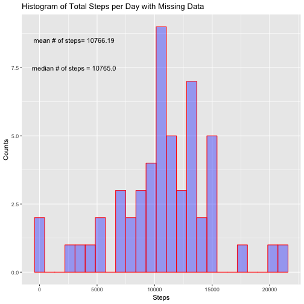

#### This is a submission for  Project 1 of the Coursera online class on Reproducible Research.

The first setion presents all the code used for analysis. All graphs are presented in the second section

### Section 1: Analysis.

##### Step 1) Read in the data set and load all libraries needed for the analysis.


```r
data_act<- read.csv('activity.csv')
library(data.table)
library(chron)
library(ggplot2)
head(data_act)
```

```
##   steps       date interval
## 1    NA 2012-10-01        0
## 2    NA 2012-10-01        5
## 3    NA 2012-10-01       10
## 4    NA 2012-10-01       15
## 5    NA 2012-10-01       20
## 6    NA 2012-10-01       25
```


##### Step 2) Calculate the total number of steps per day, mean and median number
#####of steps taken per day. 

For this step I used the function *aggregate* to calculate the required values in relation to variable *$date*


```r
# Total step per day 
        df<- aggregate(.~date,data=data_act, sum)
        total_steps<- df$steps
# Mean steps per day
        df<- aggregate(.~date, data=data_act,mean)
        mean_steps<- df$steps
# Median steps per day
        df<- aggregate(.~date,data=data_act,median)
        median_steps<- df$steps
        
        meanSteps_perDay<- mean(total_steps)
        medianSteps_perDay<- median(total_steps)
        
        rm(df)
```

##### Step 3)  What is the average daily activity pattern over 5 min time intervals?

To answer this question once again I use function *aggregate* now over variable
*$interval*. 


```r
dfNA<- aggregate(.~interval, data=data_act,mean )
        point<- which.max(dfNA$steps)
```


##### Step 4) Calculate NA's.

There are 2304 NA's in activity.csv calculated as follows:-


```r
 Num_NA<- length(which(is.na(data_act$steps)))
```

##### Step 5) Fill in missing data and recalculate total, mean & median values of steps taken per day.

To fill in missing data I use the strategy to fill all NA's in a given time interval with the median values of steps in that interval. 

```r
df<- aggregate(.~ interval, data=data_act, median)

        data_actDay<- split(data_act,data_act$date)

                 for (i in 1:length(data_actDay)){
           
                        x<- which(is.na(data_actDay[[i]]$steps))
                        data_actDay[[i]]$steps[x]<- df$steps[x]
                        }

        total_stepsfillNA <- numeric(length(data_actDay))
        mean_stepsfillNA <- numeric(length(data_actDay))
        median_stepsfillNA <- numeric(length(data_actDay))

                for (i in 1:length(data_actDay)){
   
                total_stepsfillNA[i] <- sum(data_actDay[[i]]$steps)
                mean_stepsfillNA[i] <- mean(data_actDay[[i]]$steps)
                median_stepsfillNA[i] <- median(data_actDay[[i]]$steps)
                }
         meanSteps_perDayfillNA<- mean(total_stepsfillNA)
         medianSteps_perDayfillNA<- median(total_stepsfillNA)
```

##### Step 6) Split the data based on weekends and weekdays.


```r
logic_weekend<- chron::is.weekend(data_act$date)

        data_actWD<- data_act[logic_weekend == FALSE, ]
        data_actWE<- data_act[logic_weekend == TRUE, ]

                dfWD<- aggregate(.~interval, data=data_actWD,mean)
                dfWE <- aggregate(.~interval, data=data_actWE,mean)
                
 # Combine dfWD and dfWE in a single data frame to facilitate plotting 
                
                dfWD$names<- 'Weekdays'
                dfWE$names<- 'Weekends'
                p1<-which.max(dfWD$steps) # value of p1= 104
                p2<-which.max(dfWE$steps) # value of p2=112
                FD<- rbind(dfWD,dfWE)
```


## Section 2: Histograms & Plots

##### (1) Histogram of total number of steps taken each day ( variable total_steps)


```r
H1<- qplot(total_steps,geom='histogram',bins=25, xlab='Steps',ylab='Counts',
      main='Histogram of Total Steps per Day with Missing Data', fill=I('blue'),
      col=I('red'), alpha= I(0.35)) + annotate('text', x=3000, y=8.5, label='mean # of steps= 10766.19') + annotate('text', x=3000, y= 7.5, label='median # of steps = 10765.0')

print(H1)
```



##### (2) Plot of averaged daily activity pattern


```r
P1<-       ggplot(data=dfNA, aes(x=interval,y=steps))+
                geom_line(col='blue')+xlab('Intervals')+ 
                ylab('Averaged Steps')+ggtitle('Averaged Daily Activity Pattern with NAs includes')+
                geom_point(data=dfNA, x=dfNA$interval[point],y=dfNA$steps[point],col='black')+
                annotate('text', x=1325, y=dfNA$steps[point],label='Maximum occurs at interval 835')
print(P1)
```


##### (3) Histogram of total number of steps taken each day after missing NA's were filled in.


```r
H2<-qplot(total_stepsfillNA,geom='histogram',bins=25, xlab='Steps',ylab='Counts',
      main='Histogram of Total Steps per Day with Missing Data filled in', fill=I('dark green'),
      col=I('red'), alpha= I(0.35)) + annotate('text', x=3000, y=9, label='mean # of steps= 9503.87') + annotate('text', x=3000, y= 8.5, label='median # of steps = 10395.0')

print(H2)
```


##### (4) Plot comparing averaged weekend activity pattern with averaged weekday activity pattern. 


```r
  P2<-      ggplot(data=FD, aes(x=interval,y=steps,color=names))+
                geom_line()+xlab('Intervals')+
                ylab('Averaged Steps')+
                ggtitle('Averaged Weekday Activity vs. Averaged Weekend Activity.')+
                geom_point(data=dfWD, x= dfWD$interval[p1], y=dfWD$steps[p1], col='black')+
                geom_point(data=dfWE, x=dfWE$interval[p2],y=dfWE$steps[p2],col='black')+
                annotate('text', x=1500,y=dfWD$steps[p1], label='Weekday peak occurs at interval 835')+
                annotate('text',x=1575,y=dfWE$steps[p2],label='Weekend peak occurs at interval 915')
print(P2)
```


